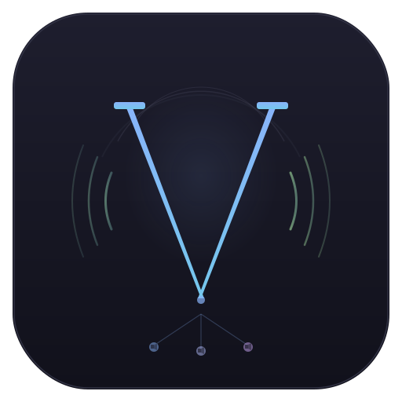

<p align="center">
  
</p>

# Vortex

Open-source macOS VM hypervisor with per-VM audio device routing. Route each VM's audio to a different host device -- something no existing macOS virtualizer supports.

## Architecture

```
macOS Guest VM                           macOS Host
+------------------------+              +------------------------+
|  App -> CoreAudio      |              |  VsockAudioBridge      |
|  -> HAL plugin         |    TCP       |  -> AudioRouter        |
|  -> shared memory      | ----------> |  -> AudioOutputUnit    |
|  -> VortexAudioDaemon  |              |  -> BlackHole / USB /  |
+------------------------+              |     any CoreAudio dev  |
                                        +------------------------+
```

Guest audio bypasses Virtualization.framework entirely. A HAL AudioServerPlugin captures PCM in a lock-free ring buffer, a daemon sends it over TCP to the host, and the host routes it to a specific CoreAudio device per VM.

## Quick Start

```bash
git clone https://github.com/lovon-spec/Vortex.git && cd Vortex
make                                          # Build + sign + guest tools
./sign-and-run.sh --gui                       # Launch GUI
```

Create a VM from the GUI or CLI:
```bash
./sign-and-run.sh create-vm --name "Dev VM" --cpu 4 --memory 8192 --disk 64
./sign-and-run.sh install-macos --vm <uuid> --ipsw /path/to/macOS.ipsw
```

Install `GuestTools/build/VortexGuestTools.pkg` inside the VM, select "Vortex Audio" as the sound device, and choose your target host device in Audio Settings.

## Requirements

- macOS 14+ (Sonoma), Apple Silicon (M1+), physical hardware (no nested virt)
- [BlackHole](https://github.com/ExistentialAudio/BlackHole) or similar virtual audio device for routing

## Features

- Per-VM audio output/input to any host CoreAudio device
- Host defaults never touched
- Native SwiftUI GUI with dark theme, VM library, display windows
- Audio device selection with persistence and live hot-swap
- Device hot-plug detection and recovery
- Guest tools: HAL AudioServerPlugin + LaunchDaemon (`.pkg`)
- CLI for headless operation
- Latency instrumentation
- Sample rate negotiation and format conversion

## Project Structure

| Module | Purpose |
|--------|---------|
| VortexCore | Models, protocols, errors, logging |
| VortexAudio | Per-VM CoreAudio routing, AudioQueue capture, ring buffers |
| VortexVZ | Virtualization.framework VM manager, TCP audio bridge |
| VortexGUI | SwiftUI app: library, display, audio settings |
| VortexCLI | Headless CLI |
| VortexHV | Hypervisor.framework VMM (Linux/Windows guests) |
| VortexDevices | Virtio device emulation |
| GuestTools/ | HAL AudioServerPlugin (C) + audio daemon (Swift) |

## Building

```bash
make                # Debug build + sign + guest tools
make release        # Optimized build
make dmg            # Distribution DMG
make clean          # Clean all
```

## Known Limitations

- **2-VM limit**: Apple Silicon kernel restriction on concurrent macOS guests
- **Guest tools**: manual install required (`.pkg` copied into guest)
- **TCC**: mic access requires launching from `.app` bundle, not bare binary
- **Latency**: ~5-15ms one-way via TCP bridge (adequate for DAW capture, not real-time monitoring)

## Docs

- [macOS Guest Audio Analysis](docs/macos-guest-audio-analysis.md) -- virtio-snd driver discovery
- [macOS Boot Analysis](docs/macos-boot-analysis.md) -- boot chain feasibility
- [vmapple Device Model](docs/vmapple-device-model.md) -- Apple's private VM platform

## License

MIT
